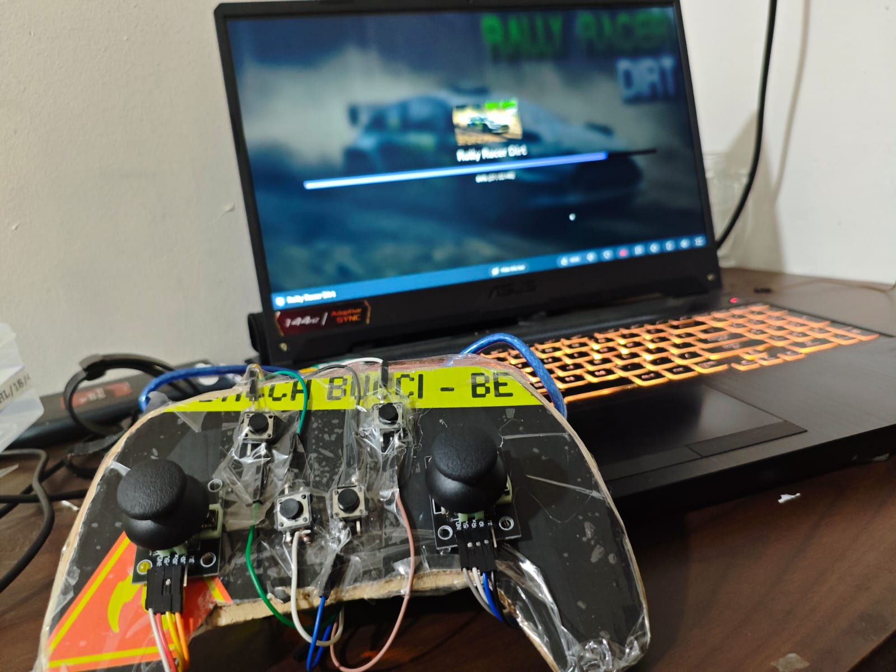
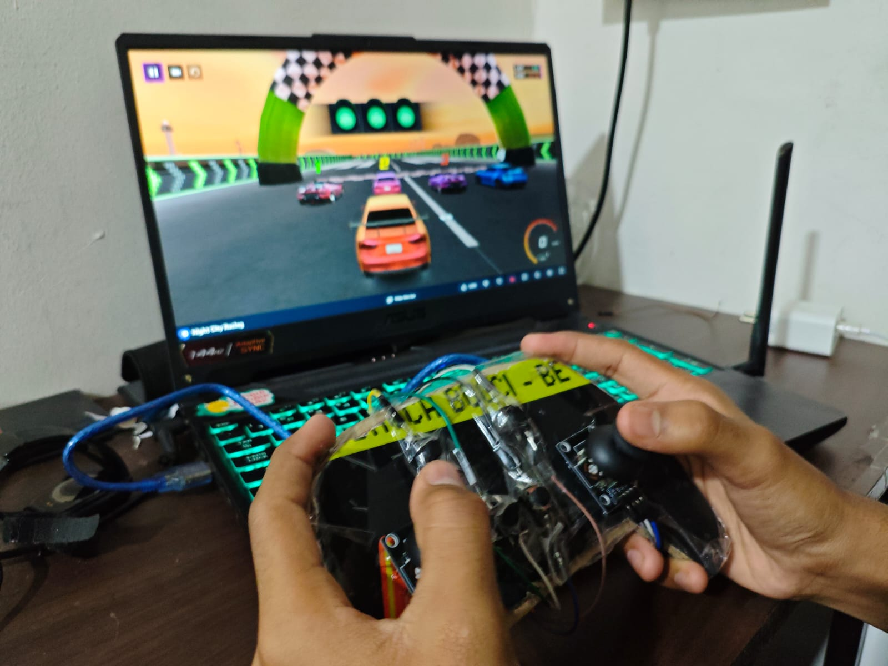

# 🎮 Arduino-Based Joystick Controller

A custom game controller built using **Arduino UNO** and **Python**, capable of converting joystick and button inputs into keyboard commands for controlling PC games and applications.

The project also includes a **Controller Hub GUI** and a **Phone Remote** feature, allowing users to control their system wirelessly through a web interface.

---

## ✨ Features

- 🎮 Dual joystick-based movement control
- 🔘 Four programmable action buttons
- ⚡ Real-time serial communication at 115200 baud
- ⌨️ Keyboard input emulation using PyDirectInput
- 🎯 Dead-zone implementation for smooth control
- 🖥 Controller Hub with live monitoring and settings
- 📱 Phone Remote using Flask and HTML/CSS/JavaScript
- 🔄 Multi-threaded architecture

---

## 🛠 Technologies Used

- Arduino UNO
- Python
- PySerial
- PyDirectInput
- Tkinter
- Flask
- HTML
- CSS
- JavaScript

---

## 📂 Repository Structure

```
Arduino-Game-Controller/
│
├── Arduino_Code/
│   └── sketch_apr8a.ino
│
├── Python_Code/
│   ├── joystick_controller.py
│   └── joystick.py
│
├── Images/
│   ├── hardware_setup.jpg
│   ├── gameplay.jpg
│   ├── phone_remote.jpg
│   └── controller_hub.png
│
├── Demo_Video/
│   └── demo.mp4
│
├── requirements.txt
├── README.md
├── .gitignore
└── LICENSE
```

---

## 🚀 Installation

### 1. Clone the repository

```bash
git clone https://github.com/YourUsername/Arduino-Game-Controller.git
```

### 2. Install dependencies

```bash
pip install -r requirements.txt
```

### 3. Upload Arduino code

Upload `sketch_apr8a.ino` to the Arduino board.

### 4. Run the Python controller

```bash
python Python_Code/joystick.py
```
or
```bash
python Python_Code/joystick_controller.py
```

---

## 📸 Project Images

Add hardware setup images, Controller Hub screenshots, and gameplay screenshots inside the `Images/` folder.

These files will be accessible from anywhere after you push the repo to GitHub. GitHub will render them automatically in the README when the paths are correct.

- `Images/hardware_setup.jpg`
- `Images/gameplay.jpg`
- `Images/phone_remote.jpg`
- `Images/controller_hub.png`

### Example image preview





---

## 🎥 Demo Video

Add the project demonstration video inside the `Demo_Video/` folder.

Once uploaded, the file will be available in the repo and can be linked using a relative path.

- `Demo_Video/demo.mp4`

### Example video link

[Watch demo video](Demo_Video/demo.mp4)

---

## 📚 Learning Outcomes

Through this project, we gained practical experience in:

- Hardware-software integration
- Serial communication
- GUI development with Tkinter
- Web development using Flask
- Multi-threading
- Embedded systems programming
- Problem-solving and teamwork

---

## 👨‍💻 Team Members

- Arjun Darwade
- Siddhant Shinde
- Samadhan Kendhale

---

## 📄 License

This project is licensed under the MIT License.
